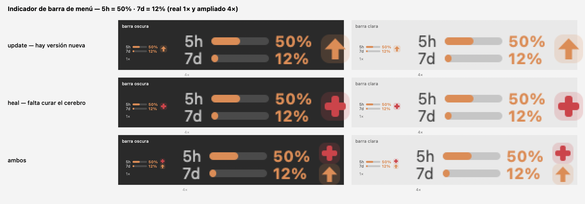

<sub>CLAUDE CODE · CEREBRO GLOBAL</sub>

# 🧠 claude-brain

[](https://github.com/unjordi/claude-brain/actions/workflows/ci.yml)
[](https://claude.ai/code)
[](#un-cerebro-tres-caras)
[](#un-cerebro-tres-caras)
[](#un-cerebro-tres-caras)
[](LICENSE)

A primera vista es **un widget**: una píldora de color en tu barra —de menú, bandeja o panel— que te
dice de un vistazo cuánto te queda de tu cuota de Claude Code, con su desglose de límites, modelos y
proyectos. Pero **crees que vienes por el widget y te llevas el tesoro**: un cerebro bien afinado y
aceitado —los guardarraíles, la gobernanza y las normas de Claude Code— que **viaja por git**,
**aplica en toda máquina**, se comunica cada vez mejor y **hace siempre el mejor equipo** contigo. 🧠

Un `install-brain.sh` y tu máquina queda con el candado puesto. Idempotente y agnóstico de OS
(todo corre bajo **bash**: macOS, Linux, Windows/Git Bash).

|  |  |  |  |
|:--|:--|:--|:--|
| **17** · hooks globales | **4** · hooks por-repo | **450+** · checks verdes | **3** · plataformas |

> El cerebro **no es propietario**: no trae skills de proyecto (ni .NET, ni repos de empresa) — solo
> hooks agnósticos, normas y una skill genérica `cerrar-slice` que cualquier proyecto puede adoptar.

## Instalar

**Un solo comando, autocontenido** — jala las dependencias solo (con el gestor del sistema) + clona +
instala. No necesitas nada preinstalado salvo el gestor (`brew`/`apt`/`dnf`/`pacman`/`zypper`, o `winget` en Windows):

```sh
# Linux / macOS
curl -fsSL https://raw.githubusercontent.com/unjordi/claude-brain/main/bootstrap.sh | bash
```
```powershell
# Windows (PowerShell)
irm https://raw.githubusercontent.com/unjordi/claude-brain/main/bootstrap.ps1 | iex
```

El bootstrap instala los prereqs que falten (git, `jq`, Node; + **.NET 10 SDK** en Windows), clona el
repo y corre el instalador maestro (**cerebro + daemon + widget**). Idempotente. Flags:
`curl -fsSL …/bootstrap.sh | bash -s -- --no-gui` (o `--no-brain`, `--no-claude-code`).

> **El widget mide tu uso de Claude Code (el CLI `claude`), no la app de escritorio.** El instalador
> también instala el CLI por ti (instalador nativo; sáltalo con `--no-claude-code`), pero el **login es
> tuyo**: corre `claude` y haz `/login` una vez. Sin sesión de Claude Code el widget solo muestra el
> fallback calibrado, no tu cuota real. (Tu suscripción Pro/Max sirve.)
>
> **Variables de entorno que el widget honra** (las mismas que Claude Code): `CLAUDE_CODE_OAUTH_TOKEN`
> (token de larga vida de `claude setup-token` — el widget lo usa directo, sin necesitar un login en
> este equipo) y `CLAUDE_CONFIG_DIR` (si moviste tu `.claude` de sitio, el widget lo busca ahí).

**O a mano**, si ya tienes los prereqs:

```sh
git clone https://github.com/unjordi/claude-brain && cd claude-brain
./install.sh                 # todo  ·  --no-gui (sin widget)  ·  --no-brain (sin cerebro)
```
Puerta por OS: **Linux/KDE** → `./install.sh` · **macOS** → [`macos/`](macos/) · **Windows** →
[`windows/`](windows/) (`pwsh -File install.ps1`). **Prereq de los guardias: [`jq`](https://jqlang.github.io/jq/)**
(sin él los hooks **fallan abierto** y no se cablea `settings.json`).

## La jerarquía — de lo más duro a la sugerencia leve

El cerebro se ordena por *dureza*: arriba lo que te **bloquea** sin negociar; abajo lo que apenas
**sugiere**. Cada pieza sabe qué evento la dispara. Esta es, tal cual, la pestaña “Cerebro” del widget.
📍 **Versión navegable** (flowcharts por capa, renderizados aquí mismo): [`docs/mapa-cerebro.md`](docs/mapa-cerebro.md).

> **¿Por qué unos bloquean y otros no?** Es cosa del *mecanismo*, no del tema. Un **hook** es un script
> que el CLI corre SOLO, en un evento, **fuera de tu turno** → por eso puede **denegar** una acción (un
> push a `develop`, un cierre sin evidencia). Un **skill** lo ejecuta el modelo **dentro** de su turno:
> no puede bloquear nada, es una guía que invocas tú. De ahí la regla: los **dientes** (deny/block) viven
> en hooks; la **lógica** se comparte en libs `.sh`; los **nudges** (recordar, rehidratar el hilo) pueden
> tener un **gemelo skill** manual (`checkpoint` escribe · `rehidratar-hilo` lee) que sobrevive aunque un
> update del CLI rompa el hook.

```
🔒 Hooks Forzosos — hooks que bloquean (deny) · no negociables
├─ 🚧 git-branch-guard         push/merge a develop·main → denegado
├─ 🔗 merge-squash-guard       MR a develop sin --squash → denegado
├─ 🕵️  secret-scan             commit/push con un secreto → denegado
├─ 💸 delegacion-gate          delegar al llegar al 90% de tu ventana 5h → pide tu OK
├─ 🛑 limite-gasto             sin ventana 5h Y sin overage (ambos agotados) → freno duro
└─ 📁 por-repo · viajan en el .claude de cada repo
   ├─ ✋ confirmar-merge-develop  merge sin tu OK → denegado
   └─ ✅ dod-verificar            cierre sin evidencia/OK → denegado; claim visual a ciegas (sin ver la pantalla) también

🔔 Automático — inyectan / recuerdan (no bloquean)
├─ 📊 recordar-dashboard       en el push recuerda dashboard + doc=realidad (README/docs) — cierre del slice
├─ 🖥️  entorno-maquina-guard    commit de algo machine-specific (aliases/rutas de $HOME/Rosetta/entorno-maquina.md) al .claude/memory/ del repo → avisa
├─ 🚧 no-bypass-deploy         correr el instalador/deploy a mano (install-brain.sh/deploy.sh) en vez de la herramienta oficial (el widget) → avisa (fail-safe: no --dry-run/--help/CI)
├─ 🕰️  rama-vieja              avisa si la ramita arrastra base vieja
├─ 🌳 proteger-arbol           git destructivo que orfanaría commits sin pushear → avisa (fan-out: usa worktree aislado)
├─ 🛡️  proteger-fuente-cerebro  editar la copia INSTALADA de un hook/skill que tiene fuente en el clon → avisa (se perdería en el próximo sync) (GLOBAL)
├─ 🧹 barrer-ramas             al abrir sesión barre en 2º plano las ramas locales ya integradas (zombie squash-safe; throttle 24h) (GLOBAL)
├─ 💾 exportar-sesion-master   auto-export de las sesiones *-master a ~/.claude-sessions (o Drive); detached, sobrevive el cleanup de 30 días (GLOBAL)
├─ 📝 delegacion-registrar     materializa el "pregunta una sola vez"
├─ 📮 delegacion-reporte       al terminar un agente: recuerda registrar avance + limpiar su worktree
├─ 🧵 rehidratar-hilo          reinyecta hilo-mental-actual.md al abrir/retomar/compactar (GLOBAL) — con gate de frescura
├─ 📈 aviso-contexto           watermark: avisa "compacta TÚ ahora" antes del auto-compact-sorpresa (GLOBAL)
├─ 🧬 aviso-drift-cerebro      repo brained atrás de la fuente única → en tu mini-develop se AUTO-SINCRONIZA (apply+commit+push); en otra rama, avisa. Al moverse el cerebro, NUDGE a correr la DUPLA (suficiencia+coherencia; contra la firma si hay AGENTS.md, si no sugiere instanciarla) (GLOBAL)
└─ 📁 por-repo · viajan en el .claude de cada repo
   ├─ 🧭 sesion-inicio            reinyecta rama + norma + memoria al abrir
   ├─ 🌾 recordar-cosechar        espejo TaskList→estado-proyecto.md (auto) + nudge: no cosechaste/no actualizaste backlog
   └─ ⬆️  recordar-unificar-cerebro  tu mini acumuló aprendizajes sin UNIFICAR a develop → sugiere /unificar-cerebro (gemelo ↑ de aviso-drift)
      (💤 precompact-volcar-estado se RETIRÓ: PreCompact no puede inyectar; lo cubren 💾 checkpoint + 🧵 rehidratar-hilo + 📈 aviso-contexto)

📜 Normas — reglas que Claude se autoimpone (CLAUDE.md)
├─ 🎯 Definition of Done       verde técnico ≠ Done/Listo/Ya Quedó; exige QA o un OK explícito
├─ 🪞 Doc <= realidad          cambió algo → su doc se actualiza en la tanda
├─ 🌿 Flujo de git             ramita → MR → develop; main es release-only
└─ 💰 Costo de delegación      gratis / incluido / con costo, según tu cuota

💡 Skills — opt-in, las invocas tú
├─ 📦 cerrar-slice             build+tests+memoria al día + MR con resumen curado
├─ 💾 checkpoint               vuelca el HILO a memoria para compactar sin perderlo (proactivo)
├─ 🗂️ to-do                    carga la interfaz de tareas del harness desde el backlog durable (estado-proyecto.md)
├─ 💧 rehidratar-hilo          relee el HILO a mano (gemelo del hook; respaldo si un update del CLI rompe el auto-rehidratado)
├─ 🐝 orquestar-fanout         fan-out sin niñera: asigna del backlog, auto-reporta y limpia al cerrar
├─ 🗺️ diagramar                diagramas por destino: .dot→dot2yed→yEd (editar a mano) · Mermaid en .md versionado (verse en GitHub)
├─ 🔬 auditar-proceso-algoritmo  auditor experto read-only (proceso industrial + algoritmo) → hallazgos priorizados; se alimenta de los flowcharts de diagramar
├─ 🩺 auditar-coherencia-cerebro fan-out read-only sobre el PROPIO cerebro (guards+flowcharts+doc): evasiones/huecos/drift, verificado por ejecución → loop hasta converger; modo-cerebro de auditar-proceso-algoritmo
├─ 🧪 auditar-suficiencia-operativa  ¿ALCANZA la doc para HACER el trabajo sin romper nada ni re-investigar? tareas reales ✅/⚠️/❌ con archivo:línea + RE-auditar tras arreglar
├─ 🧠 consolidar-cerebro       meta-orquestador: dupla → positivar → desinflar → convergencia → cierre con la FIRMA (CLAUDE+MEMORY)
├─ 🪶 desinflar-memorias       adelgaza un árbol de memorias sin perder lecciones: la narrativa se colapsa a su lección, los mitos descartados van a ⚰️ Lápidas AL FINAL
├─ 🕵️ revisar-entregables-agentes    verifica lo que un agente ENTREGA contra la realidad; no relates su reporte como verdad
├─ ☀️ positivar-doc                  reescribe answer-first: 'ESTO SÍ' (método correcto) antes del 'ESTO NO'
├─ 🎓 investigar-dominio             ponte experto en un dominio (fan-out DOC-FIRST) → memorias durables + skills
├─ 🌾 cosechar-sesion                cosecha local: extrae aprendizajes de tu sesión al inbox del equipo
├─ 🧩 unificar-cerebro               reconciliación del cerebro del equipo: integra los aprendizajes mini→develop
├─ 🧳 claude-proyecto-autocontenido  el cerebro VIVE dentro del proyecto (.claude/ + symlink de slug) → viaja con él
├─ 🔍 zoom-screenshot                recorta y amplía regiones de una captura (ffmpeg) para leer texto fino ilegible
├─ 🔩 ingenieria-inversa-gui-db-navegador  ingeniería inversa de app legacy GUI+BD: driving la UI vía navegador + diff de la BD antes/después = doc con evidencia real
├─ 📕 markdown-a-pdf                 convierte .md a PDF pulido y distribuible vía md-to-pdf (npx, sin instalar) con el gotcha de --css y QA visual real
└─ 🌙 turno-nocturno           protocolo del turno de noche: eco del contrato, decide-dentro-de-la-cerca, grants durables a disco
```

Los hooks **por-repo** son fuente en [`brain/hooks/`](brain/hooks/) que cada repo copia a su propio
`.claude/` y cablea en su `settings.json` — se cargan solo cuando una sesión *inicia* en ese repo. El
cerebro **se autoprueba**: [`brain/test-brain.sh`](brain/test-brain.sh) corre cientos de checks (el número exacto lo imprime la suite) contra un
`$HOME` aislado, y la CI repite `bash -n` + `jq empty` + `shellcheck` en cada push. Tras un fan-out,
el helper [`limpiar-worktrees.sh`](brain/hooks/limpiar-worktrees.sh) barre los worktrees de ramas ya
mergeadas y deja anotado en la bitácora el pendiente de los que sigan vivos; y
[`limpiar-ramas.sh`](brain/hooks/limpiar-ramas.sh) barre las **ramas locales** ya integradas (antídoto
a la acumulación de ramitas squasheadas: el squash rompe `git branch -d` y `fetch --prune` no toca
locales). Ambos comparten la lógica "zombie" ([`ramas-zombie.sh`](brain/hooks/ramas-zombie.sh)) → una
sola definición de "mergeada".

### 🗺️ El mapa del cerebro — fuente de verdad visual

[`docs/mapa-cerebro.md`](docs/mapa-cerebro.md) es el **mapa navegable** del cerebro (Mermaid, se
renderiza nativo en GitHub — no hace falta Graphviz ni yEd para *verlo*): un flowchart por capa
(flujo de git y sus guards · ciclo del hilo/contexto · delegación y fan-out · tiers del `MANIFEST`),
**fieles a la lógica real de los `.sh`**, más las 📜 **normas** que hacen cumplir y la leyenda con este
mismo árbol.

Es **doc de record** (norma *doc = realidad*): si cambia un hook/norma/skill —alta, baja o cambio de
lógica— se actualiza `mapa-cerebro.md` **en la misma tanda**, igual que este árbol y el conteo de
checks de `test-brain.sh`. Para el mapa *editable a mano* (yEd) el flujo va por el skill `diagramar`;
el viejo `docs/mapa-flujos.dot` (maestro único en Graphviz) se **retiró el 2026-07-29**.

## Lo que lo hace vivo — se refleja, se cura, se actualiza

El widget no dibuja un póster estático: **lee tu `~/.claude` real** y actúa sobre lo que encuentra.

<p align="center"></p>

- **🪞 Se refleja** — lee qué hooks están presentes y cableados, qué normas y skills tienes, y pinta
  el estado real de cada pieza. De cara al usuario, binario: **verde = bien, rojo = falta algo**.
- **🩹 Se cura** — ¿falta una pieza? Un botón corre el `install-brain.sh` empaquetado en la app y
  re-lee — el cerebro se completa solo, sin abrir la terminal.
- **⬆️ Se actualiza** — cada build embebe su versión, consulta `commits/main` en GitHub y ofrece un
  banner que hace **fast-forward y reinstala**. Fail-open, y **nunca te deja sin widget**.

Esas dos señales viven también en la **barra de menú**, sin abrir el popover: una **flecha** cuando hay
versión nueva y una **cruz** cuando al cerebro le falta una pieza — legibles en barra clara u oscura
(tamaño real `1×` y ampliado `4×`):

<p align="center"></p>

<!-- Regenerar esta imagen desde el PillImage.swift actual: bash macos/tools/indicador-preview/render.sh -->

## El widget — la cara del cerebro

Un daemon en segundo plano consulta el endpoint OAuth `/usage` de Anthropic y una GUI nativa muestra
una píldora de color (verde → ámbar → rojo conforme te acercas al tope); clic para el desglose. Los
mismos datos que `/usage`, en tu escritorio, desde cualquier lado. Las pestañas comparten el riel:

| | |
|---|---|
|  |  |
| **Resumen** — sesiones, mensajes, tokens, rachas, hora pico, modelo favorito, costo API-equiv y el heatmap diario. | **Límites** — ventana de 5 h y semanal, caps por-modelo, y el **gasto real de bolsillo** (spend / overage). |
|  |  |
| **Modelos** — barras apiladas por día + una fila por modelo (tokens in/out, %). | **Proyectos** — barras apiladas por día + una fila por carpeta de proyecto (tokens in/out, %). Desde aquí **renombras** una sesión (con su contexto + un botón "Sugerir nombre") y la **mueves** a otro proyecto. |

## Cómo funciona

`./install.sh` es un solo instalador maestro idempotente; el daemon y el widget van
**intencionalmente separados**; la pestaña **Cerebro** es el puente de vuelta al cerebro:

```
  ┌────────────────────────────────────────────────────────────────┐
  │  ./install.sh   —  un solo instalador maestro, idempotente       │
  └──────────────┬─────────────────────────────────┬────────────────┘
                 │ cerebro (install-brain.sh)       │ daemon + widget
                 ▼                                  ▼
  ┌───────────────────────────┐   ┌────────────────────────────────┐
  │  ~/.claude   (EL CEREBRO)  │   │  claude-brain-fetch (daemon)   │
  │  hooks/ · settings.json    │   │  systemd / launchd · piso 5 min │
  │  CLAUDE.md · skills/       │   │  bash + jq + curl(OAuth) +ccusage│
  └───────────▲───────────────┘   └────────────────┬───────────────┘
              │ refleja + cura 🩹                   │ escribe
              │  (install-brain.sh)                 ▼
              │                    ┌────────────────────────────────┐
              │                    │  ~/.cache/claude-brain/         │
              │                    │    state.json · stats.json      │
              │                    └────────────────┬───────────────┘
              │                                     │ lee cada 10 s
  ┌───────────┴─────────────────────────────────────▼──────────────┐
  │  EL WIDGET  (la cara del cerebro)  —  KDE · macOS · Windows      │
  │  píldora  +  popup: Límites · Resumen · Modelos · Proyectos · 🧠  │
  │  🧠 Cerebro refleja el cerebro · 🩹 lo cura · ⬆ se autoactualiza  │
  └─────────────────────────────────────────────────────────────────┘
              ▲ autoupdate:  mira GitHub main  →  git ff + reinstala
```

El **timer impone el piso de 5 min** a nivel del OS (la API de Anthropic avisa si sondeas de más), así
que es la única fuente de cadencia. El widget es una vista pura de `state.json`/`stats.json` (re-leída
cada 10 s), salvo la pestaña Cerebro, que lee `~/.claude` directo para reflejar el cerebro.

**Los porcentajes** salen del endpoint OAuth `/usage` (idénticos a `/usage`, `basis:"oauth"`); sin red
o sin credenciales, caen a una estimación calibrada desde los transcripts locales vía
[ccusage](https://github.com/ryoppippi/ccusage) (`basis:"cost"`). Los montos en dólares son costo
**API-equivalente** (lo que pagarías por token), no tu factura — una señal de "cuánto me ahorra el plan".

## Un cerebro, tres caras

El mismo cerebro y la misma pestaña, nativos en cada sistema — porque los guardarraíles no deben
depender de en qué te toque trabajar.

| OS | GUI | Detalle |
|---|---|---|
| 🍎 **macOS** | app de barra de menú (Swift) | [`macos/README.md`](macos/README.md) — agente `launchd` |
| 🐧 **Linux** | widget KDE Plasma 6 (QML) | [`src/README.md`](src/README.md) — timer `systemd --user`, ajustes y diagnóstico |
| 🪟 **Windows** | app de bandeja (WinForms, .NET) | [`windows/README.md`](windows/README.md) — `.exe` self-contained, sin bash/jq |

## Contribuir al cerebro

Las piezas por dentro (los tres tiers de hooks, cómo probarlas, instalar/desinstalar el cerebro
suelto) viven en **[`brain/README.md`](brain/README.md)** — la doc para contribuidores. Sumar un
guardrail o cortar un release está documentado en las skills del repo:
[`agregar-hook-cerebro`](.claude/skills/agregar-hook-cerebro/SKILL.md) y
[`publicar-widget`](.claude/skills/publicar-widget/SKILL.md).

## Desinstalar

```sh
just uninstall                   # widget + daemon
bash brain/uninstall-brain.sh    # el cerebro (idempotente; conserva tus datos)
```

`uninstall-brain.sh` quita los hooks globales, la config, la skill y el bloque de normas de
`~/.claude/CLAUDE.md`, y des-cablea de `settings.json` solo sus propias entradas — nunca toca tu
memoria, dashboard ni registro de consentimiento.

## Créditos

Nació de [`fuziontech/claude-brain`](https://github.com/fuziontech/claude-brain) (MIT),
restyleado según [`FelixDes/claude-kde-usage-widget`](https://github.com/FelixDes/claude-kde-usage-widget),
y luego crecido de "un widget de cuota" a "un cerebro portable de Claude Code con cara de widget".
Licencia **MIT** (ver [LICENSE](LICENSE); copyright original de fuziontech, conservado).

El cerebro del ícono deriva del emoji 🧠 de [Noto Emoji](https://github.com/googlefonts/noto-emoji)
de Google (Apache-2.0); el fondo grafito y el asterisco naranja son propios. Ver [NOTICE](NOTICE).
